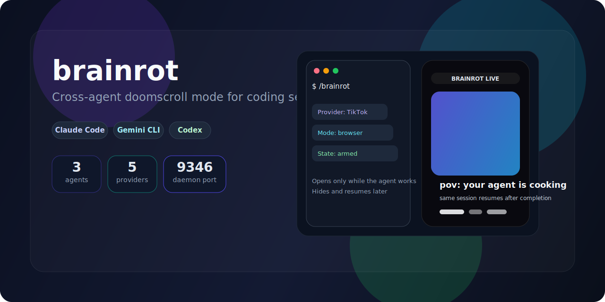
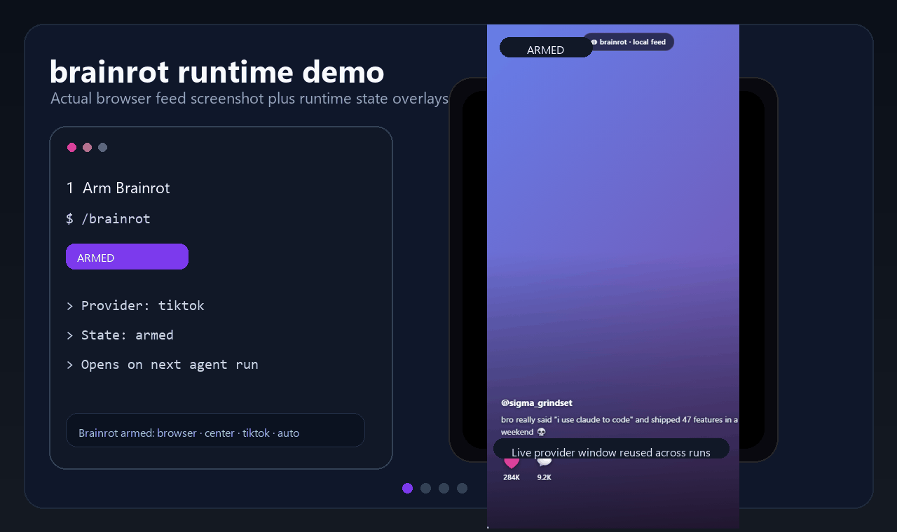
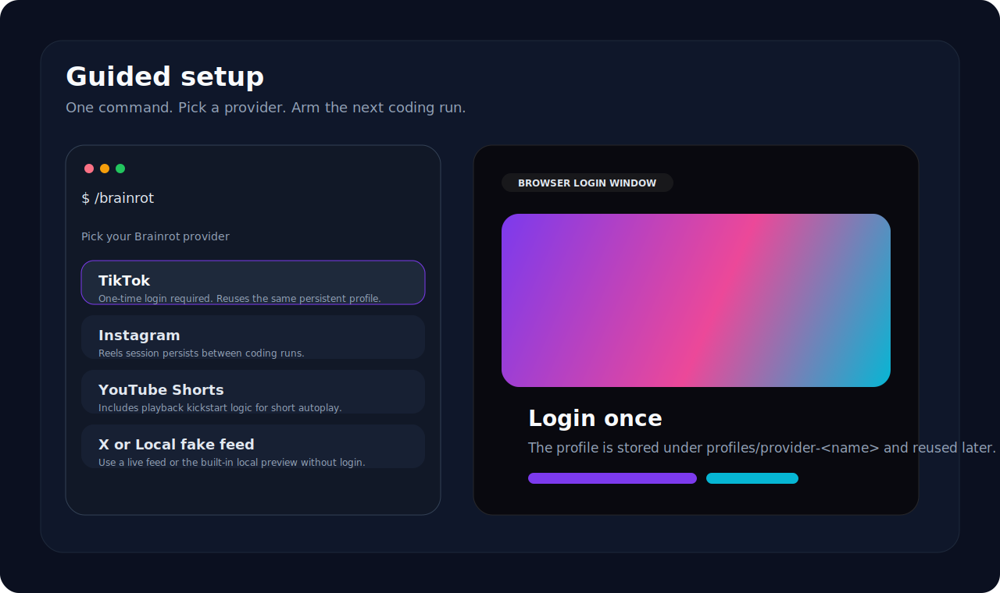
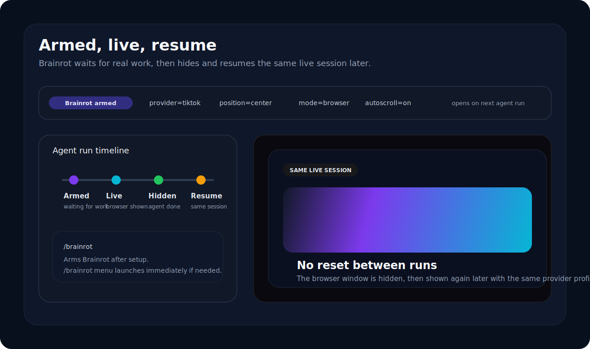
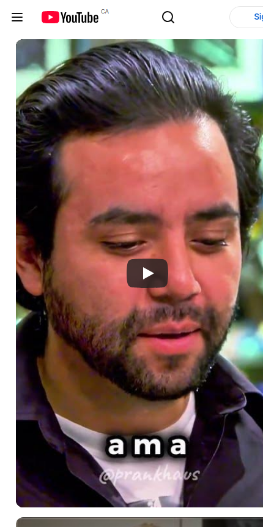
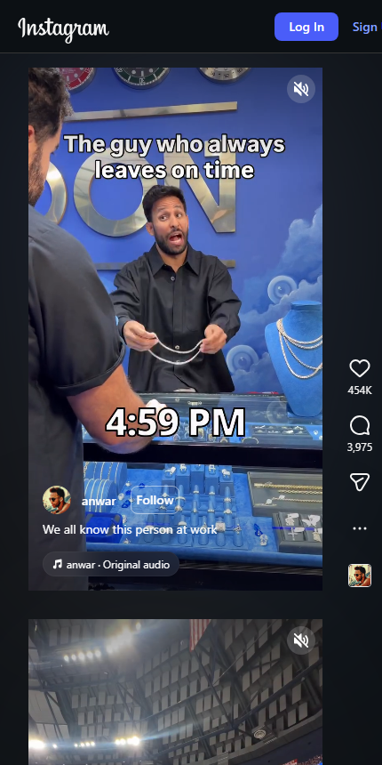
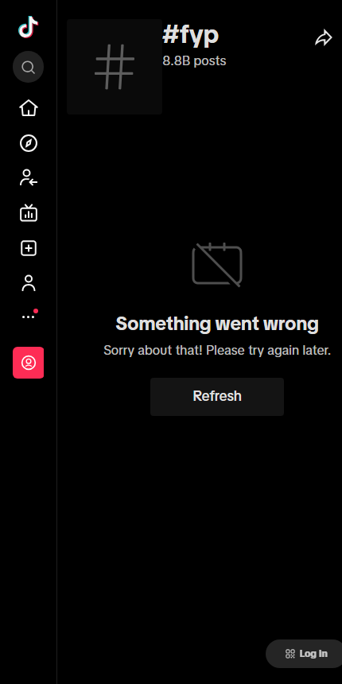
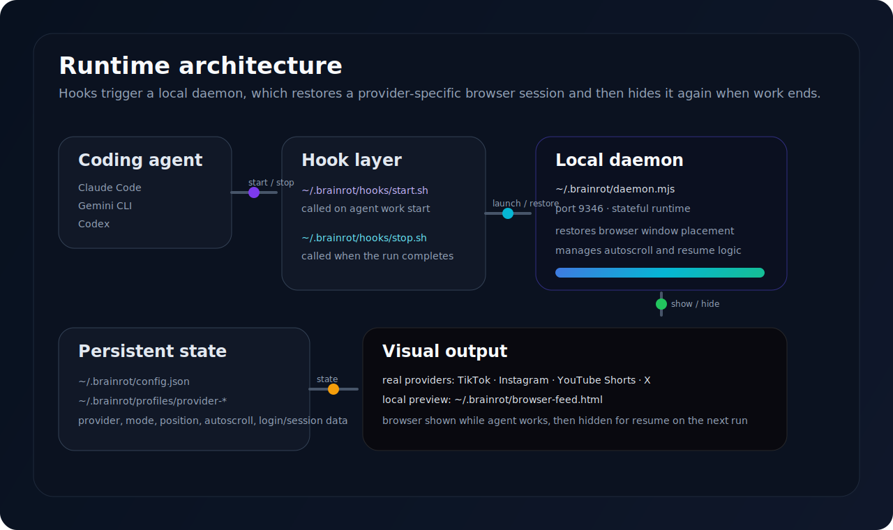

<div align="center">
  
</div>

<div align="center">

# brainrot

Cross-agent doomscroll mode for coding sessions.

[](#install)
[](#agent-support)
[](#agent-support)
[](#agent-support)
[](LICENSE)
[](https://github.com/deepmroot/brainrot/actions/workflows/ci.yml)

</div>

---

## Overview

`brainrot` wires into your coding agent, opens a real short-form feed or a local fake feed while the agent is actively working, then hides the browser and returns focus when the run finishes.

After setup, the normal flow is simple:

1. run `/brainrot` once to arm it
2. start coding with your agent
3. brainrot opens only while the agent is working
4. brainrot hides when the run ends
5. the same live session is resumed later when possible

---

## Why this exists

Most agent-side "waiting mode" ideas stop at one of these:

- a browser window that always opens from scratch
- a fake overlay with no real provider support
- a one-off hook script that breaks once setup gets more complex

`brainrot` exists to make that experience feel like a real product instead of a gimmick.

It is built around four practical goals:

1. support real coding agents, not one custom fork
2. support real providers, not just a mock overlay
3. preserve browser state and provider login between runs
4. stay opt-in, controllable, and easy to disable

That is why the project includes:

- agent-specific install wiring
- a persistent local daemon
- per-provider browser profiles
- arm/live/resume behavior instead of always-open behavior
- real-provider setup flow plus a local preview mode

---

## Statistics

<div align="center">

| Metric | Value |
|---|---:|
| Supported coding agents | 3 |
| Built-in providers | 5 |
| Hook points used | 2 |
| Daemon port | 9346 |
| Persistent profile buckets | provider + site override |
| Default idle autoscroll delay | 8 seconds |

</div>

<div align="center">


</div>

---

## Screenshots

### Demo capture



### Guided setup



### Armed and resumed session flow



### Real provider captures

| YouTube Shorts | Instagram Reels | TikTok |
|---|---|---|
|  |  |  |

Provider pages can vary by region, login state, anti-bot behavior, and autoplay policy. These captures are from live provider pages rather than mocked artwork.

---

## What it does

- opens **TikTok**, **YouTube Shorts**, **Instagram**, **X**, or a **local fake feed**
- runs only while your agent is actually working
- keeps one persistent browser profile per provider
- supports first-time login flow for real providers
- hides the browser instead of always destroying it, so the same live session can be resumed later
- supports idle-based autoscroll for real provider pages
- tries to refocus your work window when the agent finishes

---

## Feature comparison

| Capability | brainrot | Plain hook script | Basic browser opener | Fake feed only |
|---|---|---|---|---|
| Claude Code support | yes | partial | no | partial |
| Gemini CLI support | yes | partial | no | no |
| Codex support | yes | partial | no | no |
| Guided first-time setup | yes | no | no | yes |
| Real providers | yes | maybe | yes | no |
| Persistent per-provider profiles | yes | no | maybe | no |
| Armed state for next run | yes | no | no | no |
| Hide and resume same live session | yes | no | no | no |
| Idle autoscroll | yes | no | no | no |
| Shorts playback kickstart | yes | no | no | no |
| Local fake feed | yes | no | no | yes |

---

## Agent support

| Agent | Integration method | Result |
|---|---|---|
| Claude Code | `~/.claude/settings.json` hooks + Claude skill | Full `/brainrot` workflow |
| Gemini CLI | `~/.gemini/GEMINI.md` instructions | Agent can call brainrot hooks |
| Codex | `~/.codex/AGENTS.md` instructions | Agent can call brainrot hooks |

<details>
<summary><strong>What the installer changes</strong></summary>

### Claude Code
- merges `PreToolUse` hook
- merges `Stop` hook
- installs skill to `~/.claude/skills/brainrot/`

### Gemini CLI
- appends Brainrot instructions to `~/.gemini/GEMINI.md`

### Codex
- appends Brainrot instructions to `~/.codex/AGENTS.md`

### Shared runtime
Copies the runtime to:

```text
~/.brainrot/
  daemon.mjs
  browser-feed.html
  hooks/
  profiles/
  config.json
```

</details>

---

## Install

### Script installer

#### macOS / Linux / WSL

```bash
curl -fsSL https://raw.githubusercontent.com/deepmroot/brainrot/main/install.sh | bash
```

#### Windows PowerShell

```powershell
irm https://raw.githubusercontent.com/deepmroot/brainrot/main/install.ps1 | iex
```

### npx path

```bash
npx -y github:deepmroot/brainrot
```

### Global npm-style install from GitHub

```bash
npm install -g github:deepmroot/brainrot
brainrot
```

### Local repository

```bash
node bin/install.js
```

### Requirements

- Node.js 18+
- One supported coding agent:
  - Claude Code
  - Gemini CLI
  - Codex
- Edge, Chrome, or Chromium

<details>
<summary><strong>Per-agent install behavior</strong></summary>

#### Claude Code
- merges `PreToolUse` into `~/.claude/settings.json`
- merges `Stop` into `~/.claude/settings.json`
- installs the Claude skill to `~/.claude/skills/brainrot/`

#### Gemini CLI
- appends Brainrot instructions to `~/.gemini/GEMINI.md`

#### Codex
- appends Brainrot instructions to `~/.codex/AGENTS.md`

</details>

---

## Quick start

### First-time setup

Run:

```text
/brainrot
```

Then:

1. pick a provider
2. if needed, log in once in the browser window
3. finish setup
4. Brainrot is armed for later runs

### Normal use after setup

Run:

```text
/brainrot
```

This does **not** open the feed immediately after setup is complete.
It arms Brainrot for the next coding run.

When the agent starts working, Brainrot opens automatically.
When the run ends, the browser is hidden and your work window is refocused.

### Open controls manually

```text
/brainrot menu
```

Use this when you want to:
- launch immediately
- switch provider
- toggle autoscroll
- open an overlay demo
- turn Brainrot off

---

## Command reference

```text
/brainrot
/brainrot menu
/brainrot status
/brainrot on
/brainrot off
/brainrot provider tiktok
/brainrot provider instagram
/brainrot provider youtube-shorts
/brainrot provider x
/brainrot provider local
/brainrot provider-ready current
/brainrot provider-reset current
/brainrot mode browser
/brainrot mode overlay
/brainrot mode both
/brainrot position center
/brainrot position left
/brainrot position right
/brainrot autoscroll on
/brainrot autoscroll off
/brainrot browser-url https://example.com/
/brainrot browser-url local
/brainrot demo browser
/brainrot demo overlay
/brainrot demo both
```

---

## Providers

| Provider | Login required | Persistent profile | Notes |
|---|---|---|---|
| `local` | no | yes | built-in fake feed preview |
| `tiktok` | yes | yes | real feed after one-time login |
| `instagram` | yes | yes | real feed after one-time login |
| `youtube-shorts` | yes | yes | includes autoplay kickstart logic |
| `x` | yes | yes | real feed after one-time login |

### Advanced override mode

You can override the built-in provider target with a custom URL:

```text
/brainrot browser-url https://www.tiktok.com/
```

Clear the override and return to the selected provider:

```text
/brainrot browser-url local
```

---

## State model

Brainrot uses three main runtime states:

| State | Meaning |
|---|---|
| `armed` | ready for the next coding run |
| `live` | browser/feed is currently active |
| `setup` | provider login or first-time setup still pending |

The status footer reflects this in the agent UI.

---

## How session resume works

This is one of the main behaviors of the project.

When the agent finishes:
- Brainrot hides the browser window instead of always killing it
- the underlying provider session stays alive when possible
- the next time the same provider/profile is opened, the same live session is restored

This means a short, reel, or feed can continue from the same running session rather than being relaunched from scratch.

---

## Autoscroll

Autoscroll is designed for real provider pages when the user is idle.

### Rules
- enabled by default
- waits for an idle window before acting
- does not run during initial login/setup
- intended mainly for live provider feeds, not the local fake feed

### Commands

```text
/brainrot autoscroll on
/brainrot autoscroll off
```

---

## YouTube Shorts note

YouTube Shorts can open in a paused state on first display depending on browser autoplay restrictions.

Brainrot includes a playback kickstart step for Shorts that:
- finds the active video
- simulates a player interaction
- calls `video.play()`
- retries shortly after open when needed

---

## Architecture



## Internal architecture

```text
~/.brainrot/
  daemon.mjs            local runtime daemon
  browser-feed.html     local fake feed
  config.json           persisted state
  profiles/             per-provider or per-site browser profiles
  hooks/
    start.sh
    stop.sh
    activate-visual.sh
    deactivate-visual.sh
```

### Hook flow

1. Agent starts working
2. `start.sh` runs
3. daemon opens or restores the matching browser session
4. agent finishes
5. `stop.sh` runs
6. browser is hidden or stopped depending on state
7. work window is refocused

---

## Manual smoke test

For a full checklist, see:

- [`TESTING.md`](TESTING.md)

Short version:

```text
/brainrot
/brainrot status
/brainrot demo browser
/brainrot menu
/brainrot autoscroll off
/brainrot provider youtube-shorts
```

---

## Maintainer release notes

<details>
<summary><strong>Release checklist</strong></summary>

1. verify install paths still work:
   - `install.sh`
   - `install.ps1`
   - `node bin/install.js`
   - `npx -y github:deepmroot/brainrot`
2. run smoke tests from `TESTING.md`
3. confirm README screenshots and GIF still match behavior
4. commit changes
5. tag a release
6. push branch and tags
7. publish release notes on GitHub

Example:

```bash
git add .
git commit -m "Release v1.1.0"
git tag v1.1.0
git push origin main --tags
```

</details>

---

## Roadmap direction

Potential follow-up work:

- stronger provider-specific autoplay recovery
- smarter login completion detection
- richer local fake feed statistics
- more window-placement controls
- additional supported coding agents

---

## License

MIT
